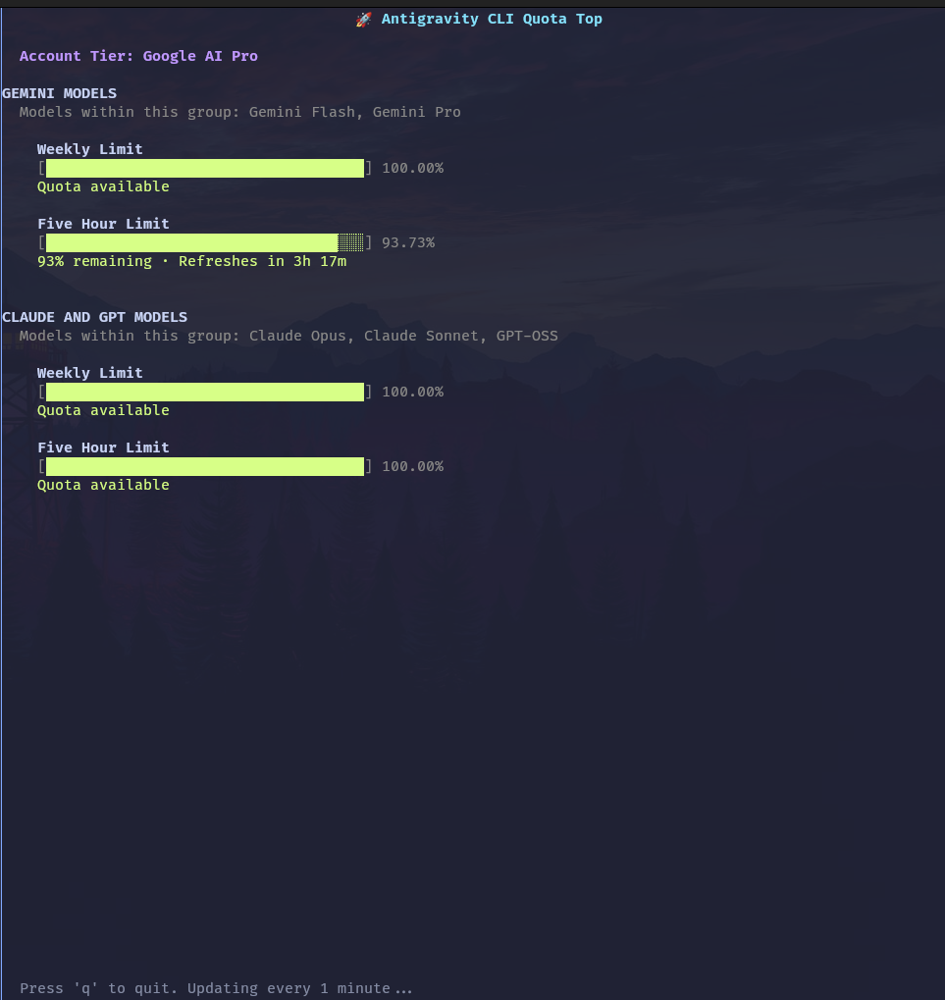

# Antigravity CLI Quota Top

A sleek, `btop`-style terminal user interface (TUI) for monitoring your active [Google AI Pro](https://antigravity.google) quota usage directly from your local Antigravity CLI daemon.



## Features

- **Live Dashboard**: Monitors your AI Pro quota usage in real-time.
- **Auto-Discovery**: Automatically finds and connects to the active Antigravity CLI background language server via internal APIs.
- **Model Grouping**: Distinctly tracks quota limits for different model families (Gemini Models vs. Claude/GPT Models).
- **Time-to-Reset**: Calculates and displays exactly how much time is left before your quota replenishes.
- **Aesthetic TUI**: Crafted with standard `curses` using a minimal and beautiful design palette.
- **Statusline Integration**: Includes `statusline.sh` and `update_quota_cache.py` to seamlessly embed the used quota of your current model into your shell prompt without blocking rendering.

## Requirements

- Python 3.6+
- `jq` (required for statusline parsing)
- Antigravity CLI (`agy`) running in the background.
- Standard terminal emulator supporting 256 colors.

## Usage

### Quota Top Dashboard

Simply run the script:

```bash
./quota_top.py
```

Press `q` at any time to exit the dashboard.

### Statusline Integration

The project now includes a background cache script and a statusline formatting script to embed your used quota directly into your prompt:

1. Ensure `update_quota_cache.py` is executable (`chmod +x update_quota_cache.py`).
2. Pipe your prompt metadata into `statusline.sh`. The script will automatically trigger background cache updates if needed and format the output:

```bash
echo '{"agent_state": "idle", "model": {"display_name": "Gemini 3.1 Pro (High)"}, "terminal_width": 100}' | ./statusline.sh
```

## How it works

The main script (`quota_top.py`) and cache script (`update_quota_cache.py`) use `ss` or `lsof` to locate the random port assigned to the `agy` daemon upon startup. They query the `/exa.language_server_pb.LanguageServerService/GetUserStatus` endpoint and extract the `cascadeModelConfigData` to render quota progress bars dynamically or save it to `~/.cache/agy_quota.json` for lightning-fast statusline access.
